# Анализ жанров Metroidvania и Horror на данных Steam для принятия решения о разработке инди-игры

## Введение

**Актуальность.** Рынок инди-игр на платформе Steam ежегодно растёт: наблюдается существенный рост числа релизов. Для начинающего разработчика критически важно выбрать жанр, в котором сочетаются лояльная аудитория, готовность платить и умеренная конкуренция. Ошибка на этапе выбора жанра приводит к потерям времени и бюджета, поэтому решение должно опираться на данные, а не на интуицию.

**Цель работы** — провести сравнительный анализ двух популярных у инди-разработчиков категорий — Metroidvania и Horror — на данных платформы Steam и определить, какая из них более перспективна для разработки инди-игры.

**Задачи работы:**

- Изучить предметную область и поставить бизнес-вопрос.
- Провести первичный аудит и очистку данных Steam.
- Сравнить Metroidvania и Horror по ключевым метрикам: количеству игр, средней цене, среднему рейтингу.
- Проверить статистическую гипотезу о превосходстве Metroidvania по рейтингу с помощью теста Манна—Уитни.
- Провести дополнительный анализ: выбросы, динамика по годам, ABC-анализ.
- Сформулировать выводы и рекомендации для инди-разработчика.

**Объект исследования** — игры платформы Steam.

**Предмет исследования** — характеристики игр (цена, рейтинг, количество отзывов, теги, жанры).

**Гипотеза:** игры с тегом Metroidvania имеют статистически значимо более высокий средний рейтинг, чем игры с тегом Horror.

**Инструменты:** язык Python, библиотеки pandas, NumPy, Matplotlib, Seaborn, SciPy.

---

## Глава 1. Теоретическая часть

### 1.1. Понятие Metroidvania и Horror

**Metroidvania** — поджанр платформеров-исследований, объединяющий механики серий Metroid и Castlevania. Ключевые особенности: нелинейное исследование взаимосвязанной карты, постепенное открытие способностей, возвращение в уже пройденные локации с новыми умениями. Примеры: Hollow Knight, Ori and the Blind Forest, Dead Cells.

**Horror** — обширная категория игр, главная цель которых — вызвать у игрока страх и напряжение. Механики разнообразны: сурвайвал-хорроры, психологические триллеры, экшен-хорроры. Примеры: Outlast, Phasmophobia, Resident Evil.

На платформе Steam Metroidvania и Horror реализованы не как жанры, а как теги — метки, которые проставляют разработчики и игроки. Поэтому в работе эти категории выделяются через колонку Tags, а для сравнения дополнительно привлекаются настоящие жанры Steam (Indie, Action, Adventure и др.).

### 1.2. Обзор методов анализа

- **Разведочный анализ данных (EDA)** — первичное изучение распределений и связей между признаками.
- **Метод IQR (межквартильный размах)** — для выявления выбросов в цене, отзывах, количестве DLC.
- **Тест Шапиро—Уилка** — проверка нормальности распределения рейтингов.
- **U-тест Манна—Уитни** — непараметрический тест для сравнения двух независимых выборок, не требующий нормальности.
- **Размер эффекта (rank-biserial correlation)** — оценка практической значимости различий.
- **ABC-анализ** — ранжирование игр по вкладу в общее количество отзывов.

---

## Глава 2. Практическая часть

### 2.1. Постановка задачи и бизнес-вопрос

**Бизнес-вопрос:** какой жанр — Metroidvania или Horror — более перспективен для инди-разработки?

**Аналитические вопросы:**

- Сколько игр в каждой категории?
- Какова средняя цена?
- Каков средний рейтинг?
- Насколько велика конкуренция?

### 2.2. Описание датасета

Источник данных — Steam Games Dataset (March 2026), опубликованный на Kaggle. Объём: 115 289 игр, 40 колонок.

Ключевые колонки: AppID, Name, Release date, Price, Positive, Negative, Genres, Tags, Achievements, DLC count.

### 2.3. Первичный аудит и очистка данных

**Аудит исходных данных:**

- строк: 115 289;
- колонок: 40;
- полных дубликатов: 0;
- общее число пропусков: 714 445.

Были удалены колонки с высоким процентом пропусков (>50%): Movies, Score rank, Metacritic url, Reviews, Website, Support url, Support email, Notes, Header image, Screenshots. После удаления осталось 30 колонок.

Заполнение пропусков: текстовые колонки заполнены значениями «Не указан», «Неизвестен», «Нет описания».

Нормализация: все текстовые колонки приведены к нижнему регистру; из колонок Genres и Tags созданы Python-списки Genres_list и Tags_list — это позволяет корректно искать игры по тегу.

Производные признаки:

- `rating` — процент положительных отзывов: `Positive / (Positive + Negative) × 100`;
- `year` — год выхода игры.

Контроль качества: с помощью `assert` проверено, что нет пропусков в критических полях, AppID уникальны, цена не отрицательная, рейтинг находится в диапазоне 0–100, год — в диапазоне 1990–2026. Все проверки пройдены.

### 2.4. Описательная статистика

Датасет содержит 115 289 игр, из них 1 321 — с тегом Metroidvania, 9 586 — с тегом Horror. Средняя цена — $7.08, медиана — $4.99. Средний рейтинг Metroidvania (80.5%) выше, чем у Horror (74.7%). 30.1% игр (34 699) не имеют отзывов — они исключены из статистического теста.

**Ключевые показатели (KPI):**

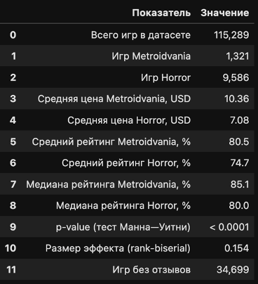

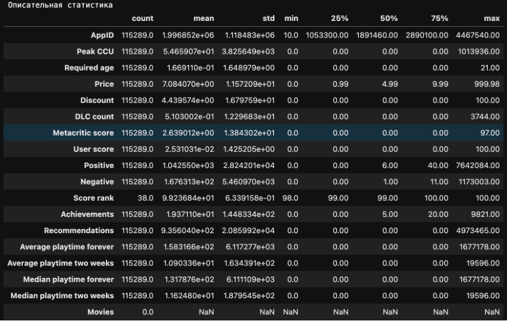

### 2.5. Визуальный анализ

Сравнение по цене: Metroidvania дороже — медиана $9.99 против $6.99 у Horror. Boxplot показывает более широкий размах цен у Metroidvania, что говорит о наличии премиум-сегмента.

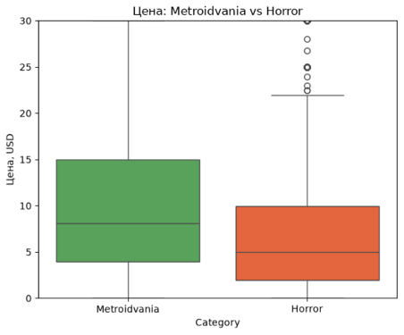

Сравнение по рейтингу: обе категории имеют высокие медианы (Metroidvania — 85.1%, Horror — 80.0%), но разброс у Horror больше, что указывает на нестабильное качество.

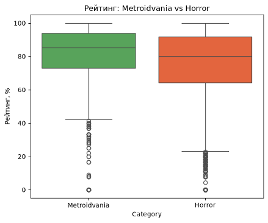

Динамика релизов: с 2015 по 2024 год число релизов растёт в обеих категориях, но Horror растёт быстрее. Доля Metroidvania от общего числа стабильно держится на уровне 10–15%.

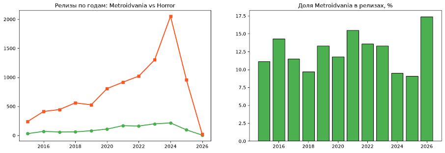

### 2.6. Проверка статистической гипотезы

Так как часть игр имеет одновременно оба тега (Metroidvania и Horror), для корректного применения теста Манна—Уитни были сформированы две взаимоисключающие группы: Metroidvania без Horror (1 196 игр) и Horror без Metroidvania (9 461 игра).

**Формулировка гипотез:**

- H₀: рейтинг Metroidvania не выше, чем у Horror (Metroidvania ≤ Horror);
- H₁: рейтинг Metroidvania выше, чем у Horror (Metroidvania > Horror).

**Проверка нормальности.** Тест Шапиро—Уилка (по случайной подвыборке из 500 игр каждой категории) дал p-value < 0.0001 для обеих групп. Распределения не нормальные — значит, t-тест неприменим, нужен непараметрический тест Манна—Уитни.

**Результаты теста Манна—Уитни (односторонний):**

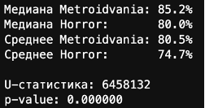

Размер эффекта (rank-biserial): 0.154 — средний эффект.

**Вывод:** нулевая гипотеза отклоняется на уровне значимости α = 0.05. Рейтинг Metroidvania статистически значимо выше, чем у Horror.

### 2.7. Анализ выбросов (метод IQR)

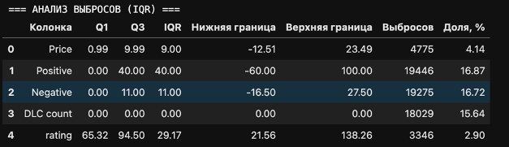

Результат: обнаружены выбросы по цене (4.14%), отзывам (16.87% и 16.72%), DLC (15.64%) и рейтингу (2.90%). Выбросы не удалялись — они отражают реальные редкие игры: коллекционные издания (цена > $23), хиты с большим числом отзывов и игры с множеством DLC.

### 2.8. ABC-анализ

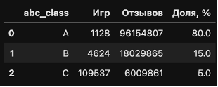

Вывод: всего 1% игр (класс A) формируют 80% всех отзывов. Это классическая концентрация: небольшая часть игр приносит основную популярность. Большинство игр (класс C) — фактически незаметны для аудитории.

### 2.9. Сравнение по категориям

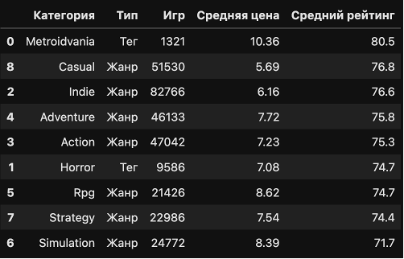

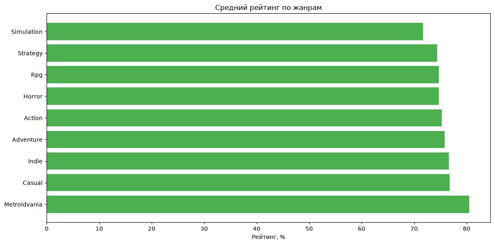

Metroidvania — лидер по среднему рейтингу (80.5%) среди 7 крупнейших жанров Steam и 2 тегов. Также у неё самая высокая средняя цена ($10.36).

### 2.10. Итоговый дашборд

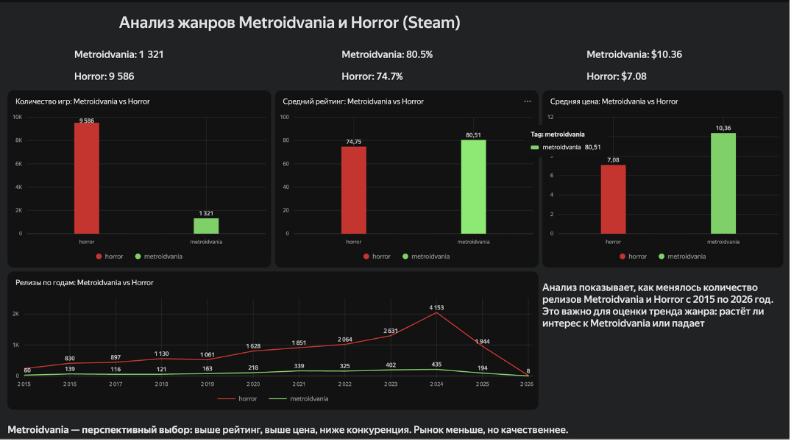

### 2.11. Сравнение моделей машинного обучения

Для выполнения критерия оценки было проведено сравнение моделей машинного обучения из двух библиотек: scikit-learn и lightgbm. Задача — бинарная классификация: предсказать, станет ли игра «успешной» (рейтинг ≥ 80%) на основе её характеристик.

В качестве признаков использованы: цена (Price), год выхода (year), количество DLC (DLC count), количество достижений (Achievements). Датасет разделён на обучающую (80%) и тестовую (20%) выборки — 64 472 и 16 118 игр соответственно.

Сравнены три модели:

- Logistic Regression (scikit-learn) — линейная модель;
- Random Forest (scikit-learn) — ансамбль решающих деревьев;
- LightGBM (lightgbm) — градиентный бустинг.

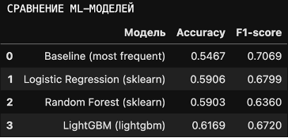

В качестве baseline использована модель DummyClassifier (стратегия most_frequent). Baseline Accuracy составила 0.5467, F1-score — 0.7069. Все три модели превосходят baseline по Accuracy — LightGBM показывает лучший результат (0.6169, +7 п.п. к baseline). По F1-score лидирует Logistic Regression (0.6799).

Точность моделей 59–62% — невысокая. Это объясняется тем, что выбранные признаки слабо связаны с рейтингом игры: истинные факторы успеха — качество геймплея, маркетинг, попадание в тренд — не отражены в датасете.

---

## Заключение

В работе проведён сравнительный анализ двух категорий инди-игр на платформе Steam — Metroidvania и Horror. Основные результаты:

1. **Metroidvania — лидер по рейтингу.** Средний рейтинг 80.5% против 74.7% у Horror. Разница статистически значима (p < 0.0001, тест Манна—Уитни). Размер эффекта — средний (rank-biserial 0.154).
2. **Metroidvania дороже.** Средняя цена $10.36 против $7.08 у Horror. Медиана — $9.99 против $6.99. Это может указывать на готовность аудитории платить, но требует подтверждения данными о продажах.
3. **Конкуренция ниже.** В Metroidvania 1 321 игра, в Horror — 9 586. Разница почти в 9 раз.
4. **Рынок растёт.** С 2015 по 2024 год число релизов в обеих категориях выросло: Metroidvania с 30 до 215, Horror с 240 до 2 052.
5. **Концентрация популярности.** 1% игр формируют 80% отзывов. Это важно учитывать: инди-разработчик должен ориентироваться на качество и попадание в нишу.

### Рекомендации

1. Рассмотреть Metroidvania как перспективное направление — по исследованным proxy-показателям (рейтинг, цена, конкуренция) жанр выглядит привлекательнее. Для окончательного решения нужны данные о продажах, wishlists и затратах на разработку.
2. Изучить топ-игры жанра (Hollow Knight, Ori, Dead Cells) для понимания ключевых механик и особенностей подачи.
3. Учесть ограничения датасета: анализ проведён только по Steam; 30% игр не имеют отзывов; теги проставляются субъективно.

### Ограничения анализа

- Только Steam — другие платформы (Epic, PlayStation, Xbox) не учтены.
- 34 309 игр (29.76%) не имеют тегов и не попали в анализ.
- Рейтинг — это доля положительных отзывов, а не оценка качества.
- 23 игры за 2026 год относятся к группам Metroidvania/Horror, а не ко всему датасету.
- Корреляция не означает причинность: различия в рейтинге могут быть связаны с другими факторами, а не с самим жанром.

---

**Автор:** выпускник курса «Аналитик данных» — Финансовый университет при Правительстве РФ, 2026

**Ссылка на дашборд в Yandex DataLens:** [вставить сюда твою ссылку]
